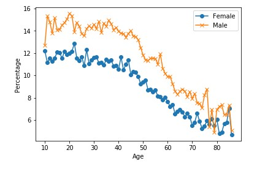
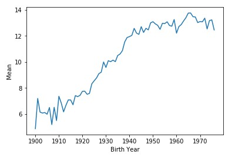
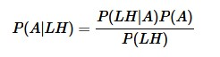

 

<h2 align='center'>Do Left-handed People Really Die Young?</h2>


<p>A 1991 study reported that left-handed people die on average nine years earlier than right-handed people.<br>Let's explore this phenomenon using age distribution data to see if we can reproduce a difference in average age at death purely from the changing rates of left-handedness over time, refuting the claim of early death for left-handers. </p>

<h3>Datasets</h3>

- [Death distribution data](https://www.cdc.gov/nchs/data/statab/vs00199_table310.pdf) for the United States from the year 1999
- [Rates of left-handedness](https://pubmed.ncbi.nlm.nih.gov/1528408/)

<h3>1. Where are the old left-handed people?</h3>

<p>A National Geographic survey in 1986 resulted in over a million responses that included age, sex, and hand preference for throwing and writing. Researchers Avery Gilbert and Charles Wysocki analyzed this data and noticed that rates of left-handedness were around 13% for people younger than 40 but decreased with age to about 5% by the age of 80. They concluded based on analysis of a subgroup of people who throw left-handed but write right-handed that this age-dependence was primarily due to changing social acceptability of left-handedness. <br>Let's start by plotting the rates of left-handedness as a function of age.</p>

```python
data_url_1 = "https://gist.githubusercontent.com/mbonsma/8da0990b71ba9a09f7de395574e54df1/raw/aec88b30af87fad8d45da7e774223f91dad09e88/lh_data.csv"
lefthanded_data = pd.read_csv(data_url_1)

fig, ax = plt.subplots() # create figure and axis objects
ax.plot(lefthanded_data.Age, lefthanded_data.Female,label='Female', marker = 'o') # plot "Female" vs. "Age"
ax.plot(lefthanded_data.Age, lefthanded_data.Male, label='Male', marker = 'x') # plot "Male" vs. "Age"

plt.show()
```



<h3>2. Rates of left-handedness over time</h3>

<p>Let's convert this data into a plot of the rates of left-handedness as a function of the year of birth, and average over male and female to get a single rate for both sexes.<br>Since the study was done in 1986, the data after this conversion will be the percentage of people alive in 1986 who are left-handed as a function of the year they were born.</p>

```python
lefthanded_data['Birth_year'] = 1986 - lefthanded_data.Age
lefthanded_data['Mean_lh'] = (lefthanded_data.Male+lefthanded_data.Female)/2

fig, ax = plt.subplots()
ax.plot(lefthanded_data.Birth_year, lefthanded_data.Mean_lh) # plot 'Mean_lh' vs. 'Birth_year'

plt.show()
```


<h3>3. Applying Bayes' rule</h3>

<p>We want to calculate the <b>probability of dying at age A given that you're left-handed</b>.<br>Here's Bayes' theorem for the two events we care about: left-handedness <code>LH</code> and dying at age <code>A</code>.</p>
<p align='center'>
  
</p>

<ul>
  <li><code>P(LH | A)</code> the probability that you are left-handed given that you died at age <code>A</code></li>
  <li><code>P(A)</code> overall probability of dying at age <code>A</code></li>
  <li><code>P(LH)</code> overall probability of being left-handed</li>
</ul>

<p>To calculate <code>P(LH | A)</code> for ages that might fall outside the original data, we will need to extrapolate the data to earlier and later years.</p>

```python
def P_lh_given_A(ages_of_death, study_year = 1990):
    """ P(Left-handed | age of death), calculated based on the reported rates of left-handedness.
    Inputs: age of death, study_year
    Returns: probability of left-handedness given that a subject died in `study_year` at age `age_of_death` """
    
    # Use the mean of the 10 neighbouring points for rates before and after the start 
    early_1900s_rate = lefthanded_data['Mean_lh'][-10:].mean()
    late_1900s_rate = lefthanded_data['Mean_lh'][:10].mean()
    middle_rates = lefthanded_data.loc[lefthanded_data['Birth_year'].isin(study_year - ages_of_death)]['Mean_lh']
    
    youngest_age = study_year - 1986 + 10 # the youngest age in the NatGeo dataset is 10
    oldest_age = study_year - 1986 + 86 # the oldest age in the NatGeo dataset is 86
    
    P_return = np.zeros(ages_of_death.shape)  # create an empty array to store the results
    # extract rate of left-handedness for people of age age_of_death
    P_return[ages_of_death > oldest_age] = early_1900s_rate / 100
    P_return[ages_of_death < youngest_age] = late_1900s_rate / 100
    P_return[np.logical_and((ages_of_death <= oldest_age), (ages_of_death >= youngest_age))] = middle_rates / 100
 
    return P_return
```

<h3>4. When do people normally die?</h3>
